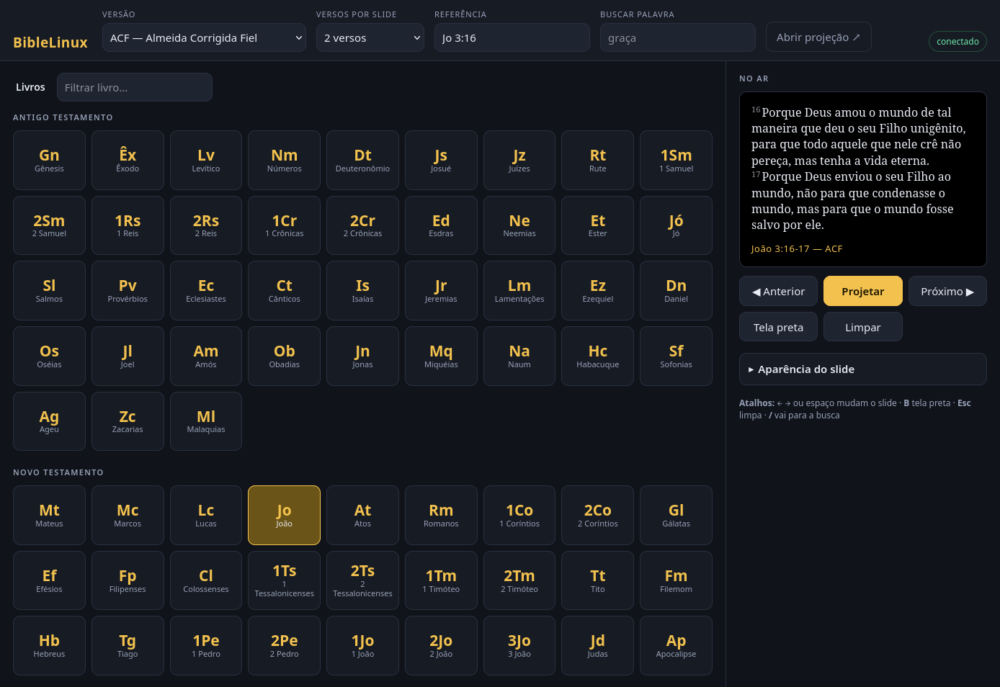
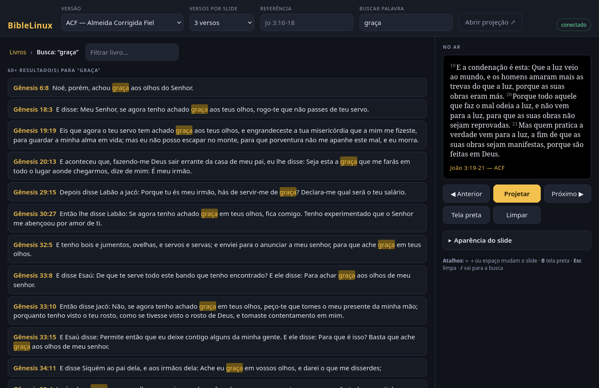

# BibleLinux

Projetor de versículos bíblicos com interface web, para rodar localmente no Linux —
no espírito do Holyrics: você escolhe o trecho num painel e ele aparece na tela do projetor.



- **Painel do operador** (`/`): grade de quadrados com a sigla e o nome dos 66 livros,
  seleção da versão, quantidade de versos por slide, busca por referência e por palavra.
- **Tela de projeção** (`/projecao`): página separada para arrastar até o projetor e deixar
  em tela cheia. Recebe as mudanças na hora, por WebSocket.
- Funciona **sem internet** depois da primeira instalação.


## Instalação

Precisa de [Node.js](https://nodejs.org) 18 ou mais novo.

```bash
git clone https://github.com/MrVeGGi3/BibleLinux.git
cd BibleLinux
npm install
npm run fetch-bibles   # baixa ACF, AA e NVI para data/ (~12 MB, só na primeira vez)
```

## Uso

```bash
npm start
```

1. Abra o painel em <http://localhost:3210>.
2. Abra <http://localhost:3210/projecao> numa segunda janela, arraste-a para o projetor
   e tecle **F11** (ou dê um duplo clique na página) para ir a tela cheia.
3. No painel: escolha a versão, quantos versos cada slide mostra, clique no livro,
   no capítulo e no verso inicial — clicar no verso já projeta.

A janela de projeção pode ser aberta e fechada a qualquer momento: ao conectar, ela já
recebe o slide que está no ar. Também serve como *Browser Source* no OBS.

### Atalhos do painel

| Tecla | Ação |
|---|---|
| `→`, `espaço`, `PageDown` | próximo bloco de versos (vira o capítulo no fim) |
| `←`, `PageUp` | bloco anterior |
| `B` | tela preta (apaga sem perder o trecho) |
| `Esc` | limpa a projeção |
| `/` | vai para a busca por palavra |
| `R` | vai para o campo de referência |

### Referências aceitas

`Jo 3:16` · `Jo 3:16-18` · `jo3.16` · `1co 13:4-7` · `I Coríntios 13:4` · `Sl 23`

Um intervalo explícito (`Jo 3:16-18`) ajusta sozinho a quantidade de versos do slide.

### Busca por palavra



Digite ao menos três letras; a busca ignora acentos e maiúsculas. Clicar num resultado projeta
o versículo na hora.

## Atalho no menu de aplicativos

```bash
npm run atalho
```

Instala o `BibleLinux` em `~/.local/share/applications/`. Clicar no atalho sobe o servidor
(se ainda não estiver no ar) e abre o painel no navegador — não é preciso deixar um terminal
aberto. O clique com o botão direito no ícone traz duas ações: **Abrir tela de projeção** e
**Parar o servidor**.

O lançador acha o Node do `nvm` sozinho, já que aplicativos gráficos não carregam o `.bashrc`.
O log do servidor fica em `~/.cache/biblelinux/servidor.log`. Se você mover a pasta do projeto,
rode `npm run atalho` de novo para atualizar os caminhos.

### Instalando pela release

Quem não quer clonar o repositório pode usar os arquivos da
[última release](https://github.com/MrVeGGi3/BibleLinux/releases/latest):

```bash
mkdir -p ~/.local/share/biblelinux
tar -xzf biblelinux-*.tar.gz --strip-components=1 -C ~/.local/share/biblelinux
install -Dm644 biblelinux.svg ~/.local/share/icons/hicolor/scalable/apps/biblelinux.svg
install -Dm644 biblelinux.desktop ~/.local/share/applications/biblelinux.desktop
```

O `biblelinux.desktop` da release não depende de onde o projeto está: ele procura o app em
`~/.local/share/biblelinux`. Na primeira vez que você clicar no ícone, o próprio lançador
instala as dependências e baixa o texto bíblico.

## Configuração

| Variável | Padrão | Para quê |
|---|---|---|
| `PORT` | `3210` | porta do servidor |
| `HOST` | `127.0.0.1` | use `0.0.0.0` para controlar de um celular ou tablet na mesma rede |

```bash
HOST=0.0.0.0 npm start   # imprime também o endereço da rede local
```

A aparência do slide (fonte, tamanho, cores, alinhamento, referência) fica em
`data/settings.json` e sobrevive ao reinício. O botão **Restaurar padrão** volta tudo ao inicial.

## Versões incluídas

| id | Versão |
|---|---|
| `acf` | Almeida Corrigida Fiel |
| `aa` | Almeida Revista e Atualizada |
| `nvi` | Nova Versão Internacional |

O texto vem de [thiagobodruk/bible](https://github.com/thiagobodruk/bible) e é baixado pelo
`npm run fetch-bibles`, não versionado no repositório — ACF e NVI são traduções com direitos
autorais, então o `data/` fica fora do git. Para acrescentar outra versão, inclua uma entrada
em `VERSIONS` no `scripts/fetch-bibles.mjs` (a origem precisa ter os 66 livros na ordem canônica).

## Como está organizado

```
scripts/fetch-bibles.mjs   baixa e normaliza o texto para data/
server/books.js            tabela dos 66 livros (sigla, nome, testamento, apelidos)
server/bible.js            leitura dos trechos e busca por palavra
server/reference.js        parser de "Jo 3:16-18"
server/state.js            estado da projeção (o servidor é o dono) e preferências
server/index.js            API REST + WebSocket
public/index.html          painel do operador
public/projecao.html       tela de projeção
scripts/biblelinux.sh      lançador usado pelo atalho (sobe o servidor e abre o navegador)
desktop/                   modelo do .desktop e ícone
```

### API

O painel é só um cliente da API; dá para automatizar por fora.

| Rota | Retorno |
|---|---|
| `GET /api/versions` | versões disponíveis |
| `GET /api/books` | os 66 livros com sigla, nome e testamento |
| `GET /api/structure?version=acf` | capítulos por livro e versos por capítulo |
| `GET /api/verses?version=&book=&chapter=&from=&to=` | um trecho |
| `GET /api/reference?version=&q=Jo+3:16` | referência resolvida e o trecho |
| `GET /api/search?version=&q=&limit=` | busca por palavra |
| `GET /api/state` | o que está no ar agora |
| `ws://…/ws` | estado em tempo real: `show`, `next`, `prev`, `blank`, `clear`, `style` |
